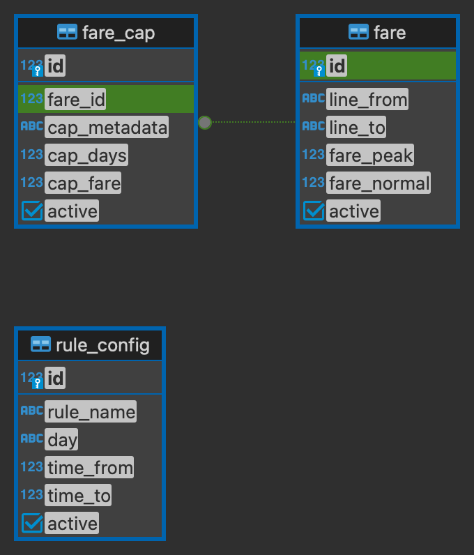

# Trip Calculation Application - Backend Setup

This repository contains the backend for the Trip Calculation Application.

## Backend

The backend consists of a Docker configuration file (`docker-compose.yml`) and a migration script that needs to be run during the first-time setup.

## Getting Started

To set up the backend, follow these steps:

1. Ensure that Node.js v18 and npm (Node Package Manager) are installed on your system.
2. Navigate to the `backend` directory.
3. Run the following command to install the dependencies:

```shell
npm install
```

## Database Table


## Project Structure 
- src/ # Main source parent folder
- docs/ # Source for OpenAPI Specs Yaml and other relevant document
- controllers/ # Route controllers 
- middlewares/ # Express middlewares
- services/ # Business logic and Data Fetching
- typeorm/ # TypeORM config
- app.ts # Express app
- config.ts # Environment variables 
- connect.ts # Database connection
- data-source.ts # TypeORM data source
- init.ts # App initialization
- server.ts # HTTP server start

### Docker Configuration

The backend is composed of two services: `postgres` and `web`.

#### Postgres Service

```
- Image: postgres:10.7
- Environment variables:
  - POSTGRES_USER: testuser
  - POSTGRES_PASSWORD: testpass
  - POSTGRES_DB: peakflo-system
- Ports:
  - Host: 5432
  - Container: 5432
- Volumes:
  - ./postgres-data:/var/lib/postgresql/data
```

#### Web Service
```
- Build context: .
- Dockerfile: dev.Dockerfile
- Links: postgres
- Container name: peakflo-test-mvp
- Ports:
  - Host: 3000
  - Container: 3000
- Environment variables:
  - PGHOST: postgres
  - PGHOST_MIGRATION: postgres
- Volumes:
  - ./:/app
```

### Environment Variables

The required environment variables can be found in the `.env.example` file. Create a new `.env` file and copy the contents from `.env.example`. Modify the values of the variables as needed.


### First-time Setup

To set up the backend for the first time, follow these steps:

1. Ensure that Docker is installed on your system.
2. Navigate to the project root directory.
3. Run the following command to start the backend services:

```shell
docker-compose up
```

4. After the services are up and running, open a new terminal window and navigate to the project root directory.
5. Run the following command to run the migration script:

```shell
npm run migration:run
```

This will start the backend application on port 3000;

### Built With
- (Node.js)[https://nodejs.org/]
- (OpenAPI / Swagger.io)[https://swagger.io/]
- (Express)[https://expressjs.com/]
- (TypeScript)[https://www.typescriptlang.org/]
- (TypeORM)[https://typeorm.io/]
- (PostgreSQL)[https://www.postgresql.org/]
## Authors

- [HendryZheng](https://github.com/xen-HendryZheng)